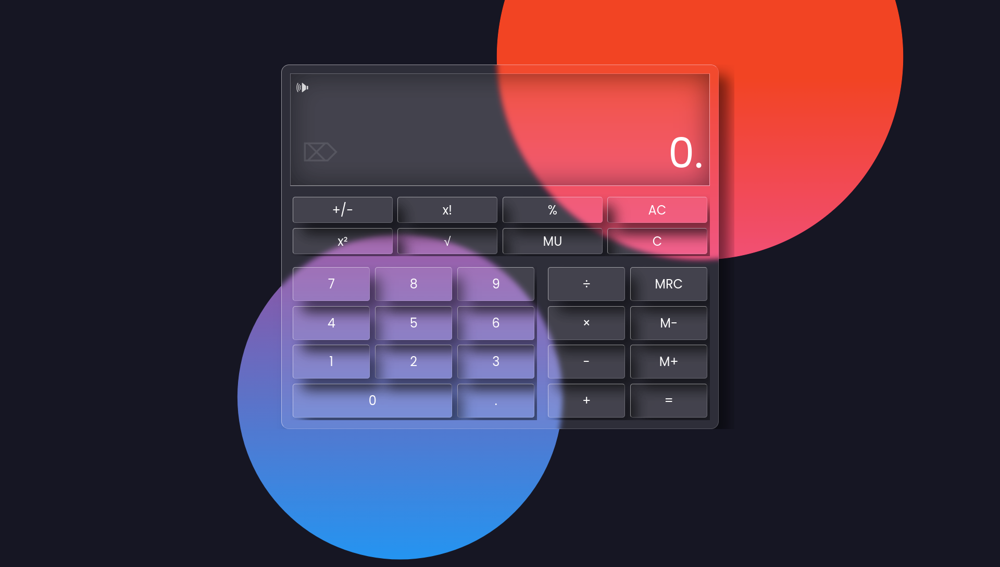

# Glossy Calculator
Last project of [TheOdinProject](https://www.theodinproject.com/lessons/foundations-calculator) from foundation curriculum.

## Learning Outcomes Summary
- Objects
  - Defining
  - Properties
  - Accessing Properties
  - Methods
  - `this` keyword
  - Accessing Methods
- Array
  - Properties and Methods

## About This Project
This is a simple calculator that can be used to perform basic math operations. Its UI is glossy and has some sound effects on key press.

## Preview
**Live:** https://szmazhr.github.io/glossy-calculator/

## Note
The outcomes listed above are not necessarily used in the project. They are just a summary of what I learned, through TheOdinProject's Curriculum, between previous project and the current one.

## Credits
- [mixkit](https://mixkit.co/): for the sound effects
- [vanilla-tilt.js](https://micku7zu.github.io/vanilla-tilt.js/): for the tilt effect on keys